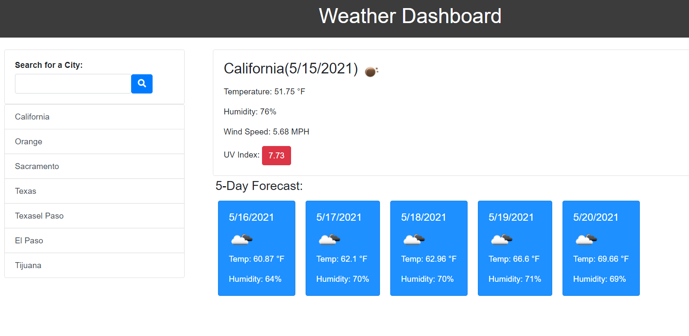

# Weather-Dashboard   

## Description
Weather Dashoboard is a app that allows you to get the current and upcoming weather conditions for any city, it also saves your past searches for quick access to a previoous city. For this task i used the openweather api to get the weather, jquery for a dynamic page.

## Preview

## Table of Contents

* [Installation](#installation)
* [Credits](#credits)
* [Questions](#questions)

## Installation

The page is deployed in the link below:
https://amado-bot.github.io/Weather-Dashboard/

## Credits

Amado-bot

## Questions

https://github.com/Amado-bot

amadocardena0@gmail.com

